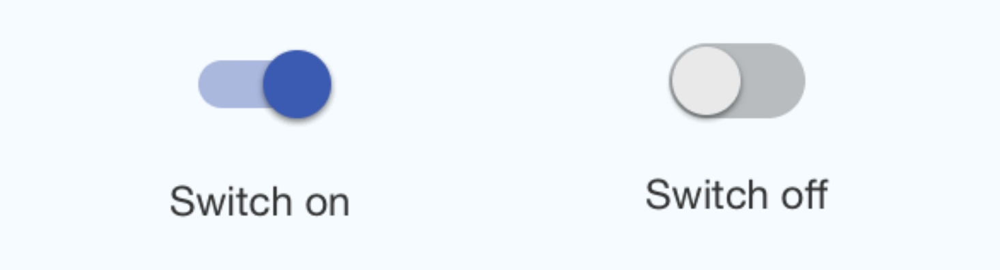

# react-native-rnmk-switch

The package is an almost full copy of the Switch component from [react-native-material-kit](https://github.com/xinthink/react-native-material-kit).

## Usage

1. Install:

  ```sh
  yarn add react-native-rnmk-switch
  ```

2. Import and use:

  ```jsx
  import Switch from 'react-native-rnmk-switch'

  <Switch
    trackLength={ 34 }
    trackSize={ 14 }
    thumbRadius={ 10 }
  />
  ```

👉 [props reference][switch-js-props-doc] and [example code][toggles-sample]

[toggles-sample]: https://github.com/xinthink/rnmk-demo/blob/master/app/toggles.js
[switch-js-props-doc]: http://www.xinthink.com/react-native-material-kit/docs/lib/mdl/Switch.html#props

